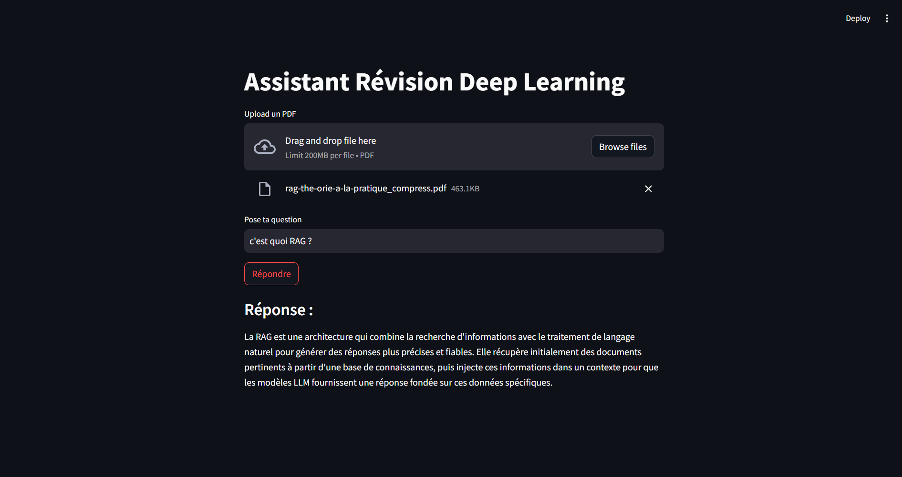

# 📚 RAG_PdfExamRevision



RAG_PdfExamRevision is a local Retrieval-Augmented Generation (RAG) system designed for exam revision using PDF course materials.

Upload a PDF and ask contextual questions about its content. The system retrieves the most relevant chunks from the document using FAISS vector search and generates an answer using a local LLM (Ollama) — fully offline and free.

---

## 🚀 Features

- 📄 Upload PDF course materials
- ✂️ Chunking with overlap to preserve context
- 🔢 Embeddings with HuggingFace (`all-MiniLM-L6-v2`)
- 📦 Vector database: FAISS
- 🤖 Local LLM via Ollama (phi3 / llama3)
- 📌 Answers based on retrieved context + page references
- 🔒 Runs locally (no OpenAI API / no quota)

---

## 🧠 How it works

**PDF → Text Extraction → Chunking → Embeddings → FAISS**  
**Question → Retrieval → Context → Local LLM → Answer**

---

## ⚙️ Installation

### 1) Install Ollama and pull a model

```bash
ollama pull phi3
